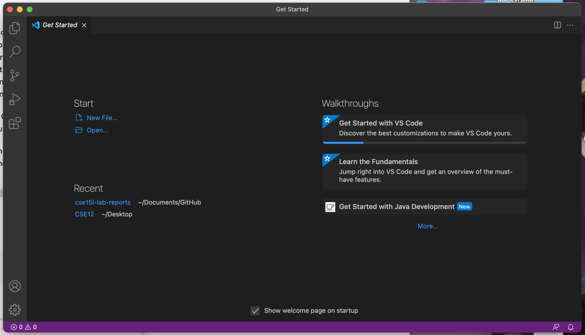

## **Week 1 Lab -- Remote Access and the Filesystem**

### **Part 1 -- Download Visual Studio Code**

```
*Visual Studio Code is a source-code editor made by Microsoft for Windows, Linux and macOS. Features include support for debugging, syntax highlighting, intelligent code completion, snippets, code refactoring, and embedded Git.*
```

First, you need to download visual studio code to your computer. 
[VSCode Download](https://code.visualstudio.com/download)

When you have it downloaded, if you open it up you will see a screen looks like this: 


**Share your progress in notes** After you arrive at this step, share a screenshot of your progress in the group doc.

### **Part 2 -- Remotely Connecting**
Starting from now, you will encounter many courses in CSE use course-specific accounts. In this course, we’ll use VScode to connect to a remote computer over the Internet to do work there.

If you are on Windows, download a program called OpenSSH first. [OpenSSH Download](https://www.openssh.com)

Then, look up your account information for this course on the below website: 
[sdacs](https://sdacs.ucsd.edu/~icc/index.php)

Then, in Visual Studio Code, we are going to connect to the remote computer using VSCode’s remote option.

---

* First, open a terminal in VSCode (Ctrl or Command + `, or use the Terminal → New Terminal menu option). Your command will look like this, but with the zz replaced by the letters in your course-specific account.
   > $ ssh cs15lwi22zz@ieng6.ucsd.edu

* You will probably get some output looks like below if this this the first time you do this:
  > ⤇ ssh cs15lwi22zz@ieng6.ucsd.edu The authenticity of host 'ieng6.ucsd.edu (128.54.70.227)' can't be established RSA key fingerprint is SHA256:ksruYwhnYH+sySHnHAtLUHngrPEyZTDl/1x99wUQcec. Are you sure you want to continue connecting (yes/no/[fingerprint])? 

* Press yes and continue to type in the password. 
 