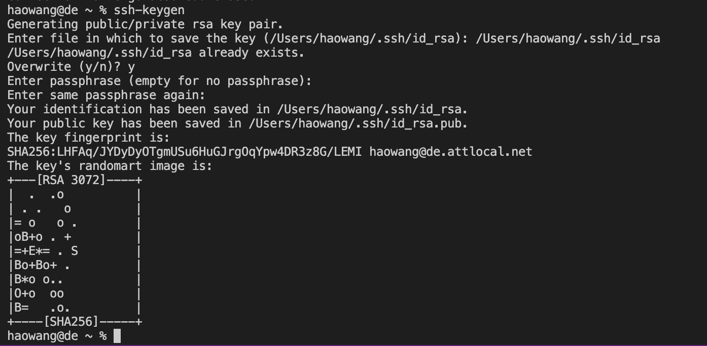
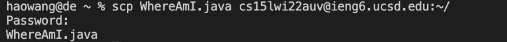

## **Week 1 Lab -- Remote Access and the Filesystem**

### **Part 1 -- Download Visual Studio Code**

```
*Visual Studio Code is a source-code editor made by Microsoft for Windows, Linux and macOS. Features include support for debugging, syntax highlighting, intelligent code completion, snippets, code refactoring, and embedded Git.*
```

First, I downloaded visual studio code to my computer from the below link.
[VSCode Download](https://code.visualstudio.com/download)

When I opened it up I saw a screen looks like this: 


### **Part 2 -- Remotely Connecting**
```
Starting from now, you will encounter many courses in CSE use course-specific accounts. In this course, we’ll use VScode to connect to a remote computer over the Internet to do work there.
```

If you are on Windows, download a program called OpenSSH first. [OpenSSH Download](https://www.openssh.com)

Then, I looked up my account information for this course on the below website: 
[sdacs](https://sdacs.ucsd.edu/~icc/index.php)

Then, in Visual Studio Code, we are going to connect to the remote computer using VSCode’s remote option.

---

* First, open a terminal in VSCode (Ctrl or Command + `, or use the Terminal → New Terminal menu option). I used below command, but with the zz replaced by the letters in my course-specific account.
   > $ ssh cs15lwi22zz@ieng6.ucsd.edu

* Because this was the first time I do this, I encountered the output looks like this: 
  > ⤇ ssh cs15lwi22zz@ieng6.ucsd.edu The authenticity of host 'ieng6.ucsd.edu (128.54.70.227)' can't be established RSA key fingerprint is SHA256:ksruYwhnYH+sySHnHAtLUHngrPEyZTDl/1x99wUQcec. Are you sure you want to continue connecting (yes/no/[fingerprint])? 

* Press yes and continue to type in the password. I saw the result:

 
>Now your terminal is connected to a computer in the CSE basement, and any commands you run will run on that computer! Your computer now is the client and the computer in the basement is the server.

### **Part 3 -- Tring Some Commands **

Then, I tried running the commands cd, ls, pwd, mkdir, and cp a few times in different ways, both on my computer and on the remote computer after ssh-ing. 

One example of the results I did on my computer would be: 


Also, i used the below command to log out of the server: 
> * Ctrl-D
> * Run the command exit

### **Part 4 -- Moving Files with scp **

Next, I tried to see how to copy files back and forth between the computers. 

I created a file on my computer called WhereAmI.java and put the following contents into it:

> class WhereAmI {
  public static void main(String[] args) {
    System.out.println(System.getProperty("os.name"));
    System.out.println(System.getProperty("user.name"));
    System.out.println(System.getProperty("user.home"));
    System.out.println(System.getProperty("user.dir"));
  }
}

* Run it using javac and java on your computer. What do you see? (If you don’t have java installed on your computer, skip this step).
* Then, in the terminal from the directory where I made the file, I ran this command with my user name:
> scp WhereAmI.java cs15lwi22zz@ieng6.ucsd.edu:~/
* You should see the text to ask you to type in your password, if you can not see this, ask the tutors for help.

Then, log into ieng6 with ssh again, and use ls. I saw the file there in my home directory! 

The output looks like this: 


### **Part 5 -- Setting an SSH Key **

```
As we are moving forward, did you realized the issue that when we log in each time, we always need to type the long passwords which takes up so much times? To avoid this repetition, we will use the ssh keys to copu the key to a particular location for faster log in. 
```
* To do this, we first need to type in command ssh-keygen. 
* Then, we type in /Users/joe/.ssh/id_rsa
* Since I did not want any password, I entered empty twice. 

Here is something you will see: 


This created two new files on your system; the private key and the public key, stored in the .ssh directory on your computer.

Now we need to copy the public (not the private) key to the .ssh directory of your user account on the server.

```
$ ssh cs15lwi22zz@ieng6.ucsd.edu
<Enter Password>
# now on server
$ mkdir .ssh
$ <logout>
# back on client
$ scp /Users/joe/.ssh/id_rsa.pub cs15lwi22@ieng6.ucsd.edu:~/.ssh/authorized_keys
```
>Remember!:You use your username and the path you saw in the command above
Once you do this, you should be able to ssh or scp from this client to the server without entering your password.

### **Part 6 -- Optimizing Remote Running **

To make the coding experience more pleasant, below are two commands you should try: 

You can write a command in quotes at the end of an ssh command to directly run it on the remote server, then exit. For example, this command will log in and list the home directory on the remote server:
```
$ ssh cs15lwi22@ieng6.ucsd.edu "ls"
```
You can use semicolons to run multiple commands on the same line in most terminals. For example, try:
```
$ cp WhereAmI.java OtherMain.java; javac OtherMain.java; java WhereAmI
```

It allows you to log in and do actions without type your password. 

