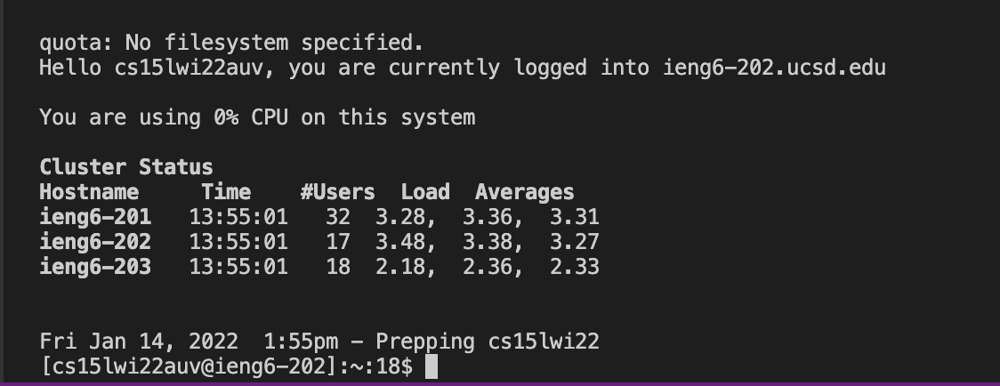
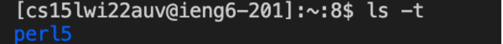
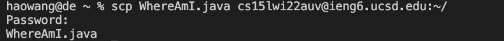

## **Week 1 Lab -- Remote Access and the Filesystem**

### **Part 1 -- Download Visual Studio Code**

```
*Visual Studio Code is a source-code editor made by Microsoft for Windows, Linux and macOS. Features include support for debugging, syntax highlighting, intelligent code completion, snippets, code refactoring, and embedded Git.*
```

First, you need to download visual studio code to your computer. 
[VSCode Download](https://code.visualstudio.com/download)

When you have it downloaded, if you open it up you will see a screen looks like this: 


**Share your progress in notes** After you arrive at this step, share a screenshot of your progress in the group doc.

### **Part 2 -- Remotely Connecting**
Starting from now, you will encounter many courses in CSE use course-specific accounts. In this course, we’ll use VScode to connect to a remote computer over the Internet to do work there.

If you are on Windows, download a program called OpenSSH first. [OpenSSH Download](https://www.openssh.com)

Then, look up your account information for this course on the below website: 
[sdacs](https://sdacs.ucsd.edu/~icc/index.php)

Then, in Visual Studio Code, we are going to connect to the remote computer using VSCode’s remote option.

---

* First, open a terminal in VSCode (Ctrl or Command + `, or use the Terminal → New Terminal menu option). Your command will look like this, but with the zz replaced by the letters in your course-specific account.
   > $ ssh cs15lwi22zz@ieng6.ucsd.edu

* You will probably get some output looks like below if this this the first time you do this:
  > ⤇ ssh cs15lwi22zz@ieng6.ucsd.edu The authenticity of host 'ieng6.ucsd.edu (128.54.70.227)' can't be established RSA key fingerprint is SHA256:ksruYwhnYH+sySHnHAtLUHngrPEyZTDl/1x99wUQcec. Are you sure you want to continue connecting (yes/no/[fingerprint])? 

* Press yes and continue to type in the password. You should see the result similar to below but with your user name:

 
 Now your terminal is connected to a computer in the CSE basement, and any commands you run will run on that computer! Your computer now is the client and the computer in the basement is the server.

 **Share your progress in notes** After you arrive at this step, share a screenshot of your progress in the group doc.


### **Part 3 -- Tring Some Commands **

Try running the commands cd, ls, pwd, mkdir, and cp a few times in different ways, both on your computer and on the remote computer after ssh-ing. Discuss with other groupmates what you see and what caused them.
 
Try these specific useful commands:

1. cd ~
2. cd
3. ls -lat
4. ls -a
5. ls <directory> where <directory> is /home/linux/ieng6/cs15lwi22/cs15lwi22abc, where the abc is one of the other group members’ username
6. cp /home/linux/ieng6/cs15lwi22/public/hello.txt ~/
7. cat /home/linux/ieng6/cs15lwi22/public/hello.txt

One example would be: 


After you tried all of these commands, share the screenshot of one of them and put it into the group doc to discuss with your mates. 

> hint: use the below command to log out of the server: 
> * Ctrl-D
> * Run the command exit

### **Part 4 -- Moving Files with scp **

Since we already figured out how we can do some work on local and remote computers. Next, we will see how to copy files back and forth between the computers. 

The command we will use in this class to achieve this is called scp, and we will always run it from the client (that means from your computer, not logged into ieng6). Create a file on your computer called WhereAmI.java and put the following contents into it:

> class WhereAmI {
  public static void main(String[] args) {
    System.out.println(System.getProperty("os.name"));
    System.out.println(System.getProperty("user.name"));
    System.out.println(System.getProperty("user.home"));
    System.out.println(System.getProperty("user.dir"));
  }
}

Run it using javac and java on your computer. What do you see? (If you don’t have java installed on your computer, skip this step).

Then, in the terminal from the directory where you made this file, run this command with your user name:
> scp WhereAmI.java cs15lwi22zz@ieng6.ucsd.edu:~/

*You should see the text to ask you to type in your password, if you can not see this, ask the tutors for help.*

Then, log into ieng6 with ssh again, and use ls. You should see the file there in your home directory! Now you can run it on the ieng6 computer using javac and java. Since java is installed on the server, everyone should be able to run it no matter the client.

Show should able to see an output looks like this: 


**Share your progress in notes** After you arrive at this step, share a screenshot of your progress in the group doc.

Before you go on, do the following:

Have someone on your team start a timer
Make a change to WhereAmI.java and save the file
Copy the file to the remote server
Log into the remote server and run the file
Stop the timer
Discuss with the whole group and someone should write answer in notes: How long did it take you?  Assume you’d have to do this process 100 times over the course of a PA. How long would you spend copying and running the file?


### **Part 5 -- Setting an SSH Key **

As we are moving forward, did you realized the issue that when we log in each time, we always need to type the long passwords which takes up so much times? To avoid this repetition 

In this case, there is a great solution – ssh keys. The idea behind ssh keys is that a program, called ssh-keygen, creates a pair of files called the public key and private key. You copy the public key to a particular location on the server, and the private key in a particular location on the client. Then, the ssh command can use the pair of files in place of your password. This is a common setup step in lots of work environments that involve code on a server.

Here is something you will see: 
![SSHkey]

If you’re on Windows, follow the extra ssh-add steps here: https://docs.microsoft.com/en-us/windows-server/administration/openssh/openssh_keymanagement#user-key-generation

This created two new files on your system; the private key (in a file id_rsa) and the public key (in a file id_rsa.pub), stored in the .ssh directory on your computer.

Now we need to copy the public (not the private) key to the .ssh directory of your user account on the server.

$ ssh cs15lwi22zz@ieng6.ucsd.edu
<Enter Password>
# now on server
$ mkdir .ssh
$ <logout>
# back on client
$ scp /Users/joe/.ssh/id_rsa.pub cs15lwi22@ieng6.ucsd.edu:~/.ssh/authorized_keys
# You use your username and the path you saw in the command above
Once you do this, you should be able to ssh or scp from this client to the server without entering your password.

**Share your progress in notes** After you arrive at this step, share a screenshot of your progress in the group doc.

### **Part 6 -- Optimizing Remote Running **

Use what you’ve learned to come up with the most pleasant process you can for making a local edit to WhereAmI.java, then copying it to the remote server and running it.

Some hints:

You can write a command in quotes at the end of an ssh command to directly run it on the remote server, then exit. For example, this command will log in and list the home directory on the remote server:
$ ssh cs15lwi22@ieng6.ucsd.edu "ls"
You can use semicolons to run multiple commands on the same line in most terminals. For example, try:
$ cp WhereAmI.java OtherMain.java; javac OtherMain.java; java WhereAmI
You can use the up-arrow on your keyboard to recall the last command that was run
Write down in notes First try using just what we learned in this lab, and document the best process you came up with. Try to get the total time for a run after editing and saving to under 10 total keystrokes/mouse clicks, including all typing.
